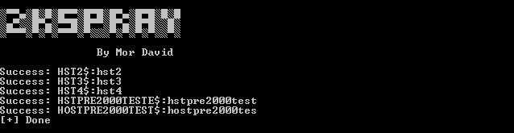

# 2KSpray
When configuring a computer account as a "pre-Windows 2000 computer," the password is derived from its name, specifically the lowercase computer name without the trailing $. Conversely, if configured differently, the password is randomly generated.\
**2KSpray is a tool that uses "asktgt," to verify Windows 2000 systems by confirming if the password aligns with the host's name.**
According to insights from a TrustedSec blog post, password changes are typically recommended after authenticating a pre-Windows 2000 computer to bolster security measures.
## Usage
```
2KSpray.exe -d/--domain <Domain> -t/--timesleep <DelayMilliseconds> [-o/--output <OutputFile>]
```

## Reference
* https://trustedsec.com/blog/diving-into-pre-created-computer-accounts